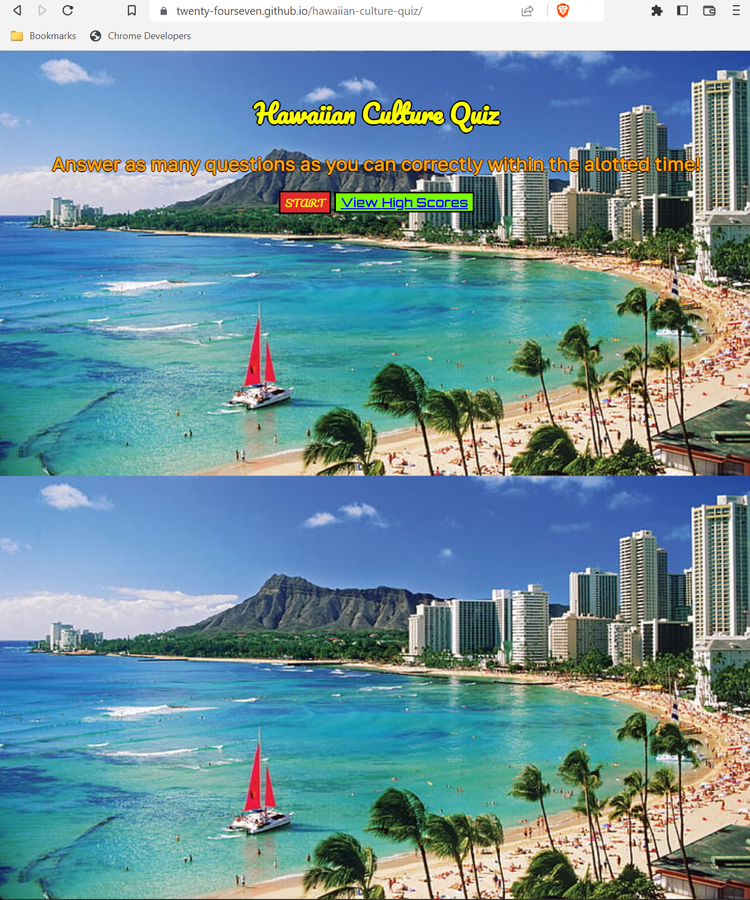

# hawaiian-culture-quiz
A timed JS quiz having questions with multiple-choice answers, a count-down timer, and a high score display section that saves to local storage.

---

## Description

An application that will hopefully broaden your understanding of Hawaiian culture.

This challenge involved creating a timed quiz, which required an understanding of programming concepts such as query selectors, event listeners, JSON, and local storage. 

Through the process of creating this quiz, I learned how to use query selectors to target specific webpage elements, how to implement event listeners to handle and respond to user input, and how to store and retrieve data via JSON.

Furthermore, in producing this quiz, I learned how to create functions to handle user input, display questions, and calculate scores. 

## Link to the Live Webpage

https://twenty-fourseven.github.io/hawaiian-culture-quiz/

## Installation

N/A

## Authors

Created by Thomas James.
GitHub: https://github.com/Twenty-FourSeven

## Usage

This website was designed as a way to help users widen their knowledge of Hawaiian culture. This quiz is available for all who want to learn, even if just a small increment more, about the ways and customs of Hawaii.

## Credits

Created by Thomas James

## License

Please refer to the LICENSE listed in the repository.